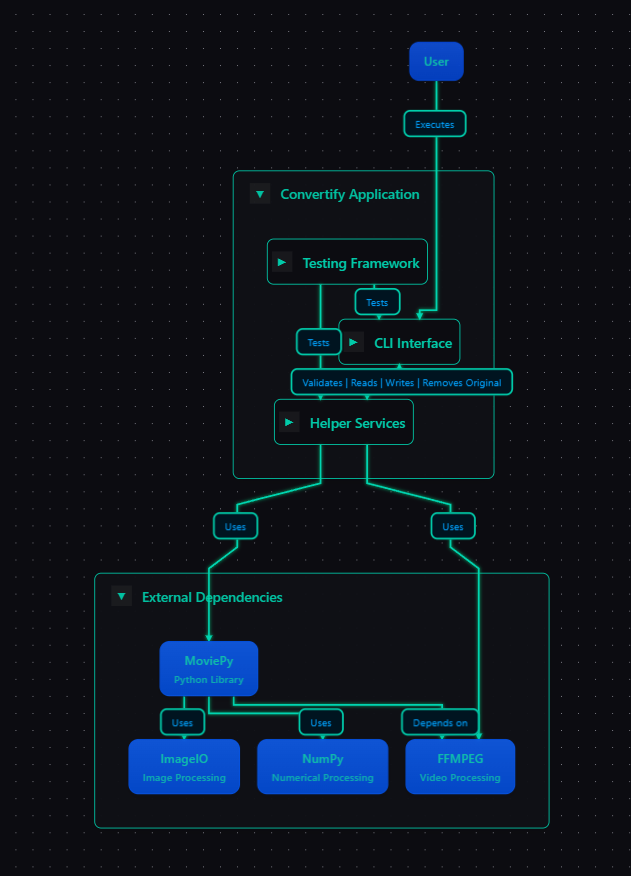
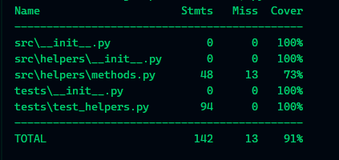

# Convertify


-----------------------------------------------
### Un servicio para convertir de forma automatica videos de formato avi a mp4.
----------------------------------------------
# Requirments

+ Python 3.12

+ Pip 

+ Pyinstaller

+ Moviepy 

+ Pytest

+ Windows Operative System
---------------------------------------------
# Usage
```bash
# Install all packages

pip install -r requirements.txt

# Generate the file .exe

pyinstaller --onefile --icon=favicon.ico main.py --collect-all moviepy

# Run the tests
pytest --cov -v

#Generate Report Coverage
pytest --cov --cov-report=html:coverage_re

```
-------------------------------------------
# Screenshots
+ Map Application

+ Running all tests



------------------------------------------
### Created by
## [ userlg ](https://github.com/userlg)
